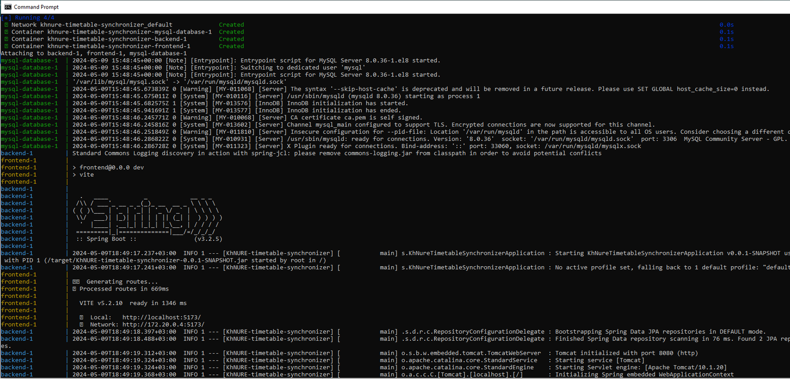

# KhNURE Timetable Synchronizer

## What is the project about?

Implementation of an application for synchronizing the schedule
from "[Kharkiv National University of Radio Electronics][1]" with Google Calendar.

## What is the purpose of this project?

The **purpose** of the project is
***implementing a wep-application for synchronizing educational timetable with Google Calendar***.
In the web-application you need to sign in with your Google account, give permission of editing your Google Calendar for
app, choose your schedule for adding in Google Calendar and press buttons for synchronization.

## Getting Started

For running the app you need to download the latest version from the **main** branch

[//]: # (and configure the web-server &#40;*if it's needed*&#41;, the database and connection to it. )
Follow the next chapters.

### Installation Instruction

#### How to download project on my local machine?

For downloading the project locally you can use two variants:

1. Download the ZIP archive from the repository page.

   The method is easy, the next steps helps you:

    1. Find the button `Code` and press it.
    2. Find the button `Download ZIP` and press it. The downloading must start.
    3. Unzip the archive in soe directory and run the IDEA in this directory.

   Project has been installed.


2. Use the `Git` for downloading the repository locally.

   The method a lit bit more difficult, but the project will be downloaded with the help
   of several commands, and not manually, as in the previous method. For this method
   you **need** to [install][4] the `Git Bash` on your computer, make some configuration and have a primary skill of
   using this system of version control.

    1. Enter your [name][5], [email][6] of GitHub account locally on your machine.
    2. Create an empty directory and initialize it as git repository. Use the next
       command - `git init`.
    3. Adds this repository to yours with name `origin` (you can change it, if you want):

       ```
       $ git remote add origin git@github.com:StasonMendelso/KhNURE-Timetable-Synchronizer.git
       ```
       But you need configure your SSH connection to your GitHub profile in Git Bash. See more [here][7].
       For viewing that the repository has been added successfully to your local
       repository, you need execute the next command and get the following result:

       ```
       $ git remote -v
       ```

       After this step your local repository has got a 'connection' to the remote project from the GitHub repository.

    4. For downloading the project use the following command:

       ```
       $ git pull origin main
       ```

       After these steps your project directory must contain the project files from
       GitHub repository. In addition to, you can create a new branch, make some
       changes and create a pull request for suggesting your improvements. Also, all
       changes are observed by the `git` and you can always make a rollback of
       all changes `git reset --hard`.

### What things you need to install the software and how to configure them?

### Run manually

##### Backend Server configuration

For running the code you needn't install server and configure it, because the Spring Boot starter
makes it instead of you. Only what you need to do is passing correct environment variables. Environment variables for
can be found [here](backend/.env.example).

For running the app on the server you need only run the main method in Java class. Also, you can
package app to the jar/war file and deploy the file on the server manually.

##### Frontend Server configuration

For running the code you need install NPM, Node. Then run next command
`npm install`. Also, you need to do is passing correct environment variables. Environment variables for can be
found [here](frontend/.env.example) and then run `npm run dev`.

##### Database configuration

You can use any relational database, but it's recommended to use a MySQL Server 8.0.31. Download and configure it.
Create a new schema with name 'timetable'. Then pass credentials to the database to environment variables to the backend
server.

### Run using a Docker

You can find a file [compose.yaml](compose.yaml) for building containers for the whole app.
For running an application you need to use a docker-compose command for build and run application. Also, you need to
pass environment variables. As there are a lot of variables, we use a .env file. This file you can get almost in anyone
of the team. Ask it someone and he send your a file. The file can be put in repository or in the directory above.

Let’s imagine, that our repository is in /root/repository and [.env file](.env.example) in /root/repository directories.
For running an
application, you need to start a docker, then build images by the following command (terminal opens in /root/repository
directory):

```
docker-compose build
```

After successfully building containers you can run them. For it use the next command:

```
docker-compose --env-file .env.dev up
```

.env.dev - is a file with environment variables. If yo put a file in another location - change a path to it.

After running you need to wait a few minutes. You can see the next in the console:




## Built With

* [Maven](https://maven.apache.org/) - Dependency Management Tool

## Authors

* **Stanislav Hlova** - *Backend
  Developer* - [StasonMendelso](https://github.com/StasonMendelso)  [](https://wakatime.com/badge/user/b33e0124-90c1-44a9-95a8-0f09b324ad70/project/018e85b7-9a4a-4fae-acf9-9ebf4d12c6cd)
* **Dmytro Kuzmenko** - *Backend
  Developer* - [Mourgarth](https://github.com/Mourgarth)  [](https://wakatime.com/badge/user/018eba51-f183-462e-bf52-7d1232edb5d0/project/018f0142-cd24-46b3-9cdd-b700d9f7453d)
* **Denys Bondarenko** - *Frontend Developer* - [denbondd](https://github.com/denbondd)
* **Bogdan Doroshenko** - *QA* - [Doroshh](https://github.com/Doroshh)

[1]:https://nure.ua/

[4]:https://git-scm.com/downloads

[5]:https://docs.github.com/en/get-started/getting-started-with-git/setting-your-username-in-git

[6]:https://docs.github.com/en/account-and-profile/setting-up-and-managing-your-personal-account-on-github/managing-email-preferences/setting-your-commit-email-address

[7]:https://docs.github.com/en/authentication/connecting-to-github-with-ssh

## License

The source code in this repository is made available under the [MIT License](/LICENSE).